# CDO Club Website Structure - Mermaid Diagrams

## 1. Overall Site Architecture

```mermaid
graph TD
    A[CDO Club Home<br/>cdoclub.com] --> B[CDO Summits<br/>cdosummit.com]
    A --> C[Careers /<br/>Executive Search]
    A --> D[Membership]
    A --> E[Publications]
    A --> F[Endorsements]
    A --> G[CDO of the Year]
    A --> H[Media Room]
    A --> I[Hall of Fame]
    A --> J[Member Login]
    
    B --> B1[CDAO Summits]
    B --> B2[CAIO Summits]
    B --> B3[Past Events]
    B --> B4[Register]
    
    C --> C1[Job Postings<br/>GOLD+ Members]
    C --> C2[Job Updates<br/>SILVER+ Members]
    C --> C3[Career Portal]
    
    D --> D1[Basic - FREE]
    D --> D2[Silver - $495/yr]
    D --> D3[Gold - $995/yr]
    D --> D4[Platinum - $1,495/yr]
    D --> D5[Corporate - $4,995/yr]
    
    E --> E1[CAIO Talent Map<br/>Coming Soon]
    E --> E2[CDO Talent Map 2013]
    E --> E3[101 CDOs to CEO<br/>Bain Capital Report]
    E --> E4[Monthly Jobs Updates<br/>2014-2024]
    
    F --> F1[CAIO/CDAO Summits<br/>23 endorsements]
    F --> F2[IBM Summits<br/>59 endorsements]
    F --> F3[Historical Events<br/>205 endorsements]
    
    G --> G1[CDAO of the Year]
    G --> G2[CDO of the Year]
    G --> G3[Past Winners<br/>2013-2022]
    
    H --> H1[Media Coverage<br/>28 pages]
    H --> H2[Press Releases<br/>10 pages]
    H --> H3[Photo Gallery]
    H --> H4[Video Gallery]
    H --> H5[Logos & Assets]
    H --> H6[Contact Info]
    
    I --> I1[CDOs → CEO<br/>101+ tracked]
    I --> I2[CDOs → Board<br/>100+ tracked]
    I --> I3[CDAOs → CEO]
    I --> I4[CDAOs → Board]
    
    style A fill:#e1f5ff
    style B fill:#ffe1e1
    style D fill:#e1ffe1
    style E fill:#fff3e1
```

## 2. Navigation Hierarchy

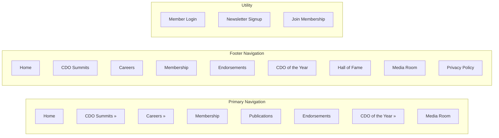

## 3. Membership Structure & Benefits Flow

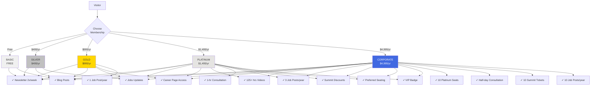

## 4. Content Organization by Topic

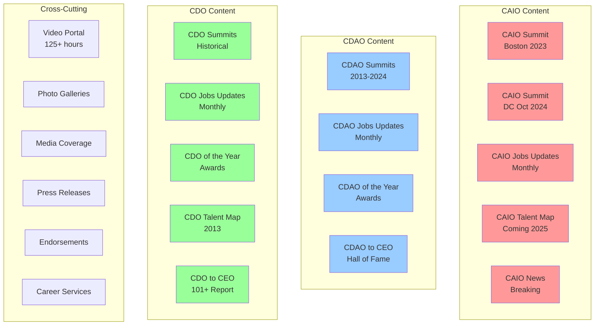

## 5. User Journey Map

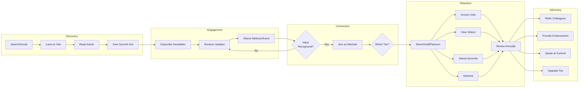

## 6. Content Access Matrix

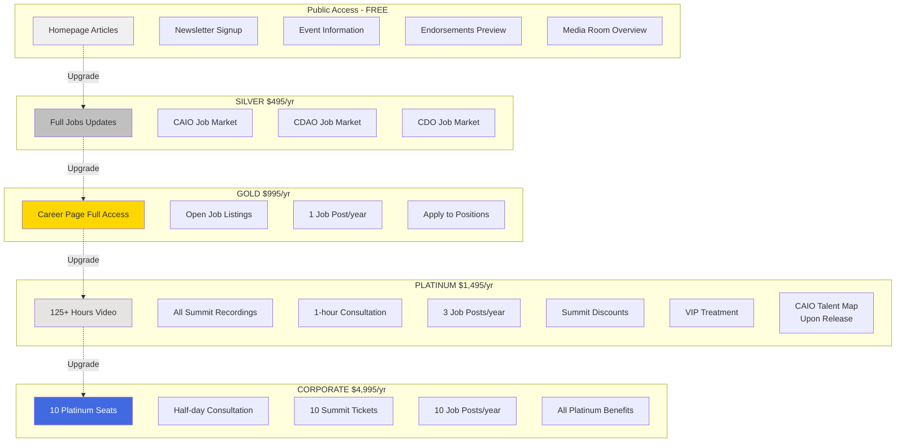

## 7. Event Ecosystem

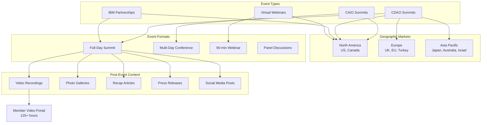

## 8. Timeline of Major Milestones

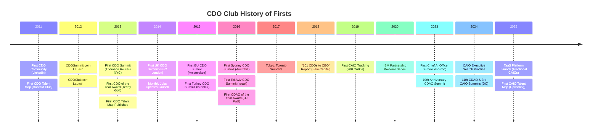

## 9. Member Value Flow

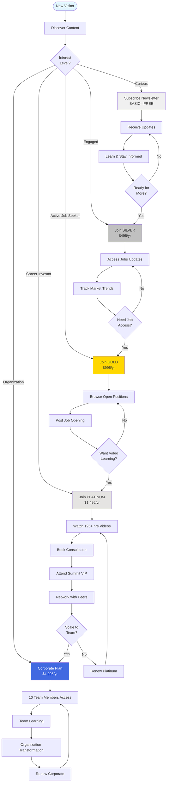

## 10. Content Types & Distribution

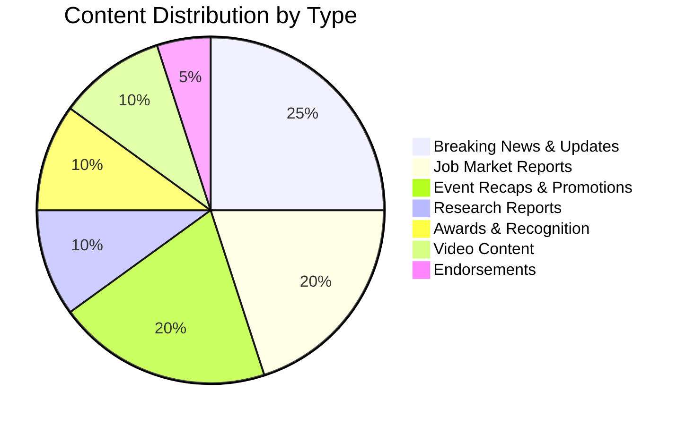

## 11. Role Focus Evolution

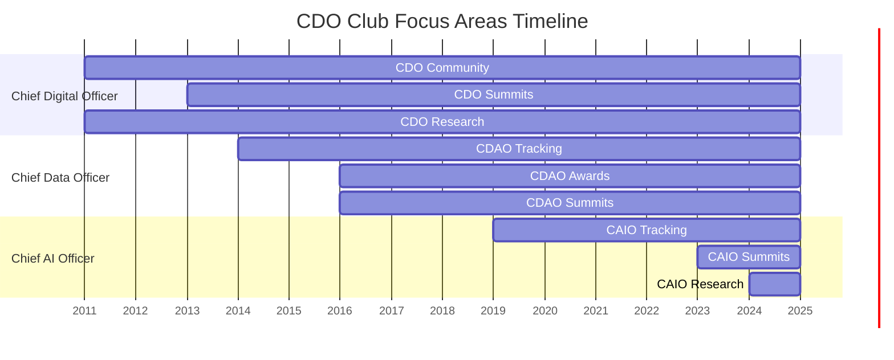

## 12. Revenue Streams Architecture

```mermaid
graph TB
    REV[Total Revenue] --> R1[Membership<br/>Subscriptions]
    REV --> R2[Event Tickets]
    REV --> R3[Sponsorships]
    REV --> R4[Job Postings]
    REV --> R5[Executive Search]
    REV --> R6[Consulting]
    
    R1 --> R1A[Basic: $0]
    R1 --> R1B[Silver: $495]
    R1 --> R1C[Gold: $995]
    R1 --> R1D[Platinum: $1,495]
    R1 --> R1E[Corporate: $4,995]
    
    R2 --> R2A[Early Bird Pricing]
    R2 --> R2B[Regular Pricing]
    R2 --> R2C[VIP Packages]
    
    R3 --> R3A[Platinum Sponsors]
    R3 --> R3B[Gold Sponsors]
    R3 --> R3C[Silver Sponsors]
    R3 --> R3D[Partners]
    
    R4 --> R4A[Individual Posts<br/>$1,000 each]
    R4 --> R4B[Membership Bundles<br/>1-10 posts]
    
    R5 --> R5A[Search Fees<br/>Commission]
    R5 --> R5B[Retained Search]
    R5 --> R5C[TaaS Platform<br/>2025 Launch]
    
    R6 --> R6A[1-hour Calls<br/>Platinum]
    R6 --> R6B[Half-day Sessions<br/>Corporate]
    R6 --> R6C[Custom Programs]
    
    style REV fill:#4169e1,color:#fff
    style R1 fill:#90EE90
    style R2 fill:#FFD700
    style R3 fill:#FF6B6B
```

## 13. External Link Ecosystem

```mermaid
graph LR
    SITE[cdoclub.com] --> EXT1[LinkedIn Group<br/>4176032]
    SITE --> EXT2[Twitter<br/>@BeTheMedia]
    SITE --> EXT3[Facebook<br/>/CDOClub]
    SITE --> EXT4[Instagram<br/>@davidmathison]
    SITE --> EXT5[YouTube<br/>BeTheMedia]
    SITE --> EXT6[LinkedIn Profile<br/>/davidmathison]
    
    SITE --> DOM1[cdosummit.com<br/>Summit Info]
    SITE --> DOM2[caiosummit.com<br/>CAIO Summit]
    SITE --> DOM3[boston.cdosummit.com]
    SITE --> DOM4[dc.cdosummit.com]
    SITE --> DOM5[nyc.cdosummit.com]
    SITE --> DOM6[london.cdosummit.co.uk]
    SITE --> DOM7[sydney.cdosummit.com]
    SITE --> DOM8[cdoclub.jp<br/>Japan]
    SITE --> DOM9[cdoclub.co.il<br/>Israel]
    
    SITE --> PAY[1ShoppingCart<br/>Payment Processing]
    SITE --> MAIL[Mailchimp<br/>Email Marketing]
    SITE --> EVT[Eventbrite<br/>Event Registration]
    
    style SITE fill:#e1f5ff
    style DOM1 fill:#ffe1e1
    style DOM2 fill:#ffe1e1
```

## 14. Information Architecture - Publications Section

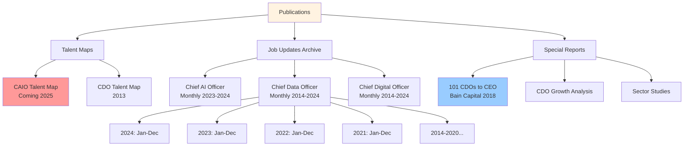

## 15. Awards Program Structure

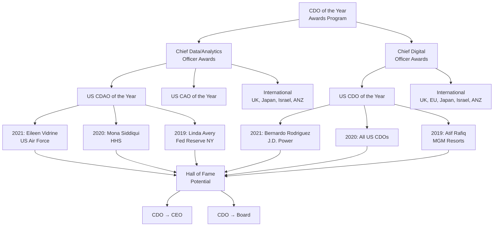

## 16. Partner & Sponsor Ecosystem

```mermaid
graph TD
    PARTNERS[Partners & Sponsors] --> CAT1[Platinum Partners]
    PARTNERS --> CAT2[Academic Partners]
    PARTNERS --> CAT3[Corporate Sponsors]
    PARTNERS --> CAT4[Media Partners]
    
    CAT1 --> P1[IBM<br/>Long-term Partner]
    CAT1 --> P2[Microsoft]
    CAT1 --> P3[Accenture]
    CAT1 --> P4[McKinsey]
    CAT1 --> P5[Bain Capital]
    
    CAT2 --> A1[Northeastern University<br/>Institute for Experiential AI]
    CAT2 --> A2[Columbia University]
    CAT2 --> A3[Harvard University]
    CAT2 --> A4[UTS Sydney]
    CAT2 --> A5[University of Maryland]
    
    CAT3 --> C1[Alation]
    CAT3 --> C2[BigID]
    CAT3 --> C3[Thomson Reuters]
    CAT3 --> C4[BBC]
    CAT3 --> C5[CNN/Time Warner]
    
    CAT4 --> M1[Forbes]
    CAT4 --> M2[Wall Street Journal]
    CAT4 --> M3[CNBC]
    CAT4 --> M4[Financial Times]
    
    style P1 fill:#4169e1,color:#fff
    style A1 fill:#90EE90
```

## 17. Data Flow & Analytics

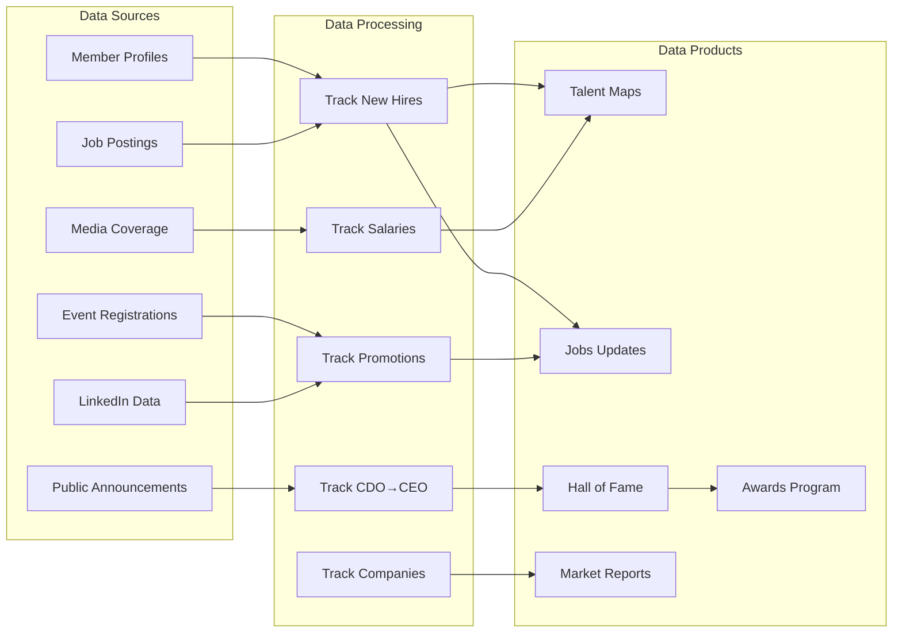

## 18. Complete Site Map

```mermaid
graph TD
    ROOT[cdoclub.com] --> L1_1[Home]
    ROOT --> L1_2[CDO Summits]
    ROOT --> L1_3[Careers]
    ROOT --> L1_4[Membership]
    ROOT --> L1_5[Publications]
    ROOT --> L1_6[Endorsements]
    ROOT --> L1_7[CDO of Year]
    ROOT --> L1_8[Media Room]
    ROOT --> L1_9[Hall of Fame]
    ROOT --> L1_10[Privacy Policy]
    ROOT --> L1_11[Member Login]
    
    L1_1 --> L2_1[Breaking News]
    L1_1 --> L2_2[Featured Articles]
    L1_1 --> L2_3[Photo Gallery]
    L1_1 --> L2_4[Newsletter Signup]
    L1_1 --> L2_5[Summit Promos]
    L1_1 --> L2_6[Blog Archive<br/>35+ pages]
    
    L1_2 --> L2_7[cdosummit.com]
    L1_2 --> L2_8[caiosummit.com]
    L1_2 --> L2_9[Event Calendar]
    L1_2 --> L2_10[Past Events]
    L1_2 --> L2_11[Registration]
    
    L1_3 --> L2_12[Open Positions<br/>GOLD+ Only]
    L1_3 --> L2_13[Job Updates<br/>SILVER+ Only]
    L1_3 --> L2_14[Career Advice]
    L1_3 --> L2_15[Executive Search]
    
    L1_4 --> L2_16[Basic FREE]
    L1_4 --> L2_17[Silver $495]
    L1_4 --> L2_18[Gold $995]
    L1_4 --> L2_19[Platinum $1,495]
    L1_4 --> L2_20[Corporate $4,995]
    L1_4 --> L2_21[Benefits Comparison]
    L1_4 --> L2_22[Join Now]
    
    L1_5 --> L2_23[CAIO Talent Map<br/>Coming Soon]
    L1_5 --> L2_24[CDO Talent Map 2013]
    L1_5 --> L2_25[101 CDOs to CEO]
    L1_5 --> L2_26[Jobs Archives]
    L1_5 --> L2_27[Download Forms]
    
    L2_26 --> L3_1[CDO Jobs 2014-2024]
    L2_26 --> L3_2[CDAO Jobs 2014-2024]
    L2_26 --> L3_3[CAIO Jobs 2023-2024]
    
    L1_6 --> L2_28[CAIO Summit: 15]
    L1_6 --> L2_29[CDAO Summit: 8]
    L1_6 --> L2_30[IBM Summits: 59]
    L1_6 --> L2_31[Historical: 205]
    
    L1_7 --> L2_32[CDAO Awards]
    L1_7 --> L2_33[CDO Awards]
    L1_7 --> L2_34[2013-2022 Winners]
    L1_7 --> L2_35[Award Criteria]
    
    L2_32 --> L3_4[US Winners]
    L2_32 --> L3_5[International]
    L2_33 --> L3_6[US Winners]
    L2_33 --> L3_7[International]
    
    L1_8 --> L2_36[Media Coverage<br/>28 pages]
    L1_8 --> L2_37[Press Releases<br/>10 pages]
    L1_8 --> L2_38[Photo Gallery]
    L1_8 --> L2_39[Video Gallery]
    L1_8 --> L2_40[CDO Talent Map<br/>Infographics]
    L1_8 --> L2_41[Logos & Creative]
    L1_8 --> L2_42[David Mathison Bio]
    L1_8 --> L2_43[Contact Info]
    
    L1_9 --> L2_44[CDOs → CEO]
    L1_9 --> L2_45[CDOs → Board]
    L1_9 --> L2_46[CDAOs → CEO]
    L1_9 --> L2_47[CDAOs → Board]
    L1_9 --> L2_48[2011-2023 Data]
    
    L2_44 --> L3_8[101+ Tracked]
    L2_45 --> L3_9[100+ Tracked]
    
    style ROOT fill:#4169e1,color:#fff
    style L1_1 fill:#e1f5ff
    style L1_4 fill:#e1ffe1
    style L1_5 fill:#fff3e1
```

